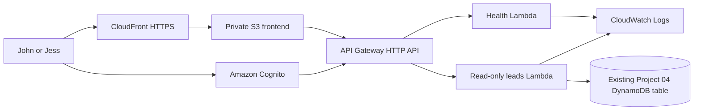

# F4F Operations Dashboard

Project 06 is the authenticated internal application foundation for managing
Fenton4Fitness operations. It is deliberately separate from the public
marketing website and does not expose production client data in Phase 1.

## Phase 1 status

Phase 1 provides a responsive application shell, local authentication guard,
dashboard empty states, a mock read-only lead viewer, modular Lambda handlers,
backend tests, deployment-gated Terraform, and production-oriented security
documentation. It does **not** create AWS resources, Cognito users, DNS records,
or production-table changes.

## Architecture



See [docs/ARCHITECTURE.md](docs/ARCHITECTURE.md) for the trust boundaries and
future `dashboard.fenton4fitness.com` integration.

## Technologies

- Semantic HTML, modular vanilla JavaScript, and responsive CSS
- Amazon Cognito user pool architecture with owner/admin and future coach roles
- API Gateway HTTP API with a Cognito JWT authorizer
- Small Python Lambda functions for health and read-only lead access
- Existing Project 04 DynamoDB table through least-privilege IAM
- Private S3 frontend origin and CloudFront HTTPS delivery
- Terraform with an explicit deployment gate

## Relationship to Projects 03–05

- Project 03 remains the public Fenton4Fitness website and form frontend.
- Project 04 remains the production lead ingestion and notification pipeline.
- Project 05 remains the public website infrastructure.
- Project 06 will read an allowlisted projection of Project 04 leads; it does not
  change the capture Lambda, table, website, or production infrastructure.

## Local development

Python 3 and any static HTTP server are sufficient.

```powershell
cd frontend
python -m http.server 8080
```

Open `http://localhost:8080`. The local preview gate uses `sessionStorage` and
contains no real user account. It must never be treated as production auth.

Run checks from the repository root:

```powershell
powershell -File scripts/check.ps1
```

Or run components separately:

```powershell
node --check frontend/js/config.js
node --check frontend/js/auth.js
node --check frontend/js/api.js
node --check frontend/js/data.js
node --check frontend/js/app.js
node frontend/tests/auth-guard.test.js
python -m unittest discover backend/tests -v
terraform -chdir=terraform fmt -check -recursive
terraform -chdir=terraform validate
```

## Security approach

- The browser never receives AWS credentials or DynamoDB permissions.
- Production API routes require Cognito JWT authorization.
- The lead Lambda can read only the exact existing table ARN.
- API responses use an explicit field allowlist and exclude messages, goals,
  injury history, medical notes, and other sensitive narrative fields.
- CORS uses explicit origins and the API has conservative throttling.
- Lambda logs contain counts and error classes, not lead data.
- Terraform state, tfvars, plans, environment files, and build output are ignored.

See [docs/SECURITY.md](docs/SECURITY.md) before any deployment.

## Deployment plan

1. Review the existing table name, ARN, encryption, backups, and access pattern.
2. Decide whether Cognito advanced security features and MFA settings meet the
   desired cost and usability profile.
3. Copy `terraform/terraform.tfvars.example` to an ignored tfvars file.
4. Set exact existing-resource identifiers and keep `deploy_dashboard = false`.
5. Run and review a no-change foundation plan.
6. Set the gate true only after explicit approval and review the complete plan.
7. Deploy initially on the CloudFront hostname; create no DNS record.
8. Later request ACM coverage and create a Porkbun CNAME for
   `dashboard.fenton4fitness.com` through a separately approved change.

## Planned expansion

The long-term roadmap includes authenticated lead status management, athlete and
client profiles, scheduling, training programs, revenue, messaging, analytics,
and carefully governed AI-assisted workflows. See [docs/ROADMAP.md](docs/ROADMAP.md).
