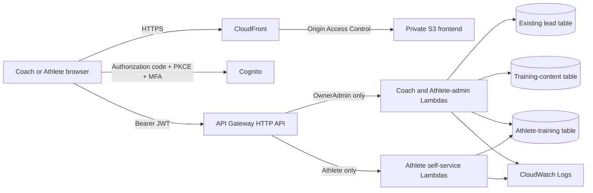

# F4F Operations Dashboard

Project 06 is the authenticated Fenton4Fitness Coach/Athlete application. It is
the most complete and integrated project in this portfolio, bringing together
lessons and architecture developed through the earlier IAM, hosting, serverless,
and Terraform projects.

## Problem

The public Fenton4Fitness website captures leads, but coaches also need a private
place to review operational data, maintain an exercise library, build reusable
workouts, and eventually deliver assigned sessions to athletes. This project
creates that internal application without exposing private workflows through the
public marketing site.

## Current capabilities

### OwnerAdmin Coach experience

- authenticated lead review with an allowlisted response projection
- exercise search, categories, equipment/movement filters, aliases, and favorites
- sectioned workout builder with rounds, supersets, AMRAPs, prescriptions, and instructions
- immutable workout-template versions with idempotent create/update behavior
- production Sign Out and responsive desktop/mobile layouts
- adult Athlete profile/assignment administration for the bounded beta slice

### Adult Athlete beta — Phase 4A Slice 1

- separate Athlete Cognito identity and exact-group authorization
- active subject-to-profile ownership mapping
- Coach-created assignments containing immutable versioned workout snapshots
- one resumable session per assignment
- optimistic revision checks and server-enforced assignment/session transitions
- adult-only scope with no minor, guardian, medical, nutrition, or free-text Athlete notes

The richer fictional Athlete prototype remains available only on localhost for
future design work. Production bundle tests prevent fixture data and preview
controls from being uploaded.

## Architecture



See [Architecture](docs/ARCHITECTURE.md), [Security](docs/SECURITY.md),
[Data model](docs/DATA-MODEL.md), and
[Adult Beta design](docs/ADULT-BETA-DESIGN.md).

## Technologies

- semantic HTML, responsive CSS, and modular vanilla JavaScript
- Python Lambda handlers
- Cognito managed login with authorization code, PKCE, and MFA
- API Gateway HTTP API with JWT authorizers and explicit CORS
- DynamoDB conditional writes, transactions, sparse indexes, PITR, encryption,
  and deletion protection
- CloudFront, private S3, ACM HTTPS, CloudWatch Logs, and scoped IAM
- Terraform with staged deployment gates and reviewed saved plans

## Request and trust flow

1. Cognito authenticates the browser and issues tokens.
2. The browser sends a bearer token to an API Gateway route.
3. API Gateway validates the JWT.
4. The Lambda performs a second exact-group check.
5. Athlete routes derive ownership from the token subject mapping; the browser
   cannot select another Athlete identity.
6. IAM limits each Lambda to the actions and tables required by that route group.

## Important technical decisions

- **Defense in depth:** API JWT validation does not replace Lambda role checks.
- **Immutable history:** workout edits create new versions rather than rewriting old ones.
- **Stable assignments:** Athlete assignments contain a snapshot of the approved template version.
- **Retry safety:** idempotency receipts and conditional writes prevent duplicate versions.
- **Concurrency safety:** session writes require the expected revision.
- **Data minimization:** lead responses and the adult beta exclude unnecessary narrative and sensitive fields.
- **Bundle separation:** local prototype assets and fictional data are not production objects.

## Production problems solved

- diagnosed a DynamoDB transaction failure using sanitized CloudWatch details and
  added only the exact missing IAM actions
- corrected API Gateway CORS when browser preflight evidence showed the custom
  `idempotency-key` header was not allowed
- made Lambda packaging deterministic by excluding bytecode/cache artifacts
- stopped full Workout Builder rerenders on normal input so focus, caret, and
  scroll position remain stable
- preserved legacy flat workouts while introducing sectioned schema version 2

## My role and what I learned

I developed this project by extending each phase in small, reviewed slices and
verifying the result with local tests, Terraform plans, and production acceptance
checks. My work included connecting the frontend to authenticated APIs, shaping
the DynamoDB access patterns, tightening role and IAM boundaries, documenting
deployment decisions, and troubleshooting failures across the browser and AWS
services.

The biggest progression for me was learning to think about the application as
one integrated system rather than as a collection of separate AWS services. A
browser failure can originate in CORS, authentication, IAM, Lambda code, or data
conditions, so I learned to follow evidence across those boundaries and make the
smallest correction that preserved working behavior. I am still developing this
skill, and the remaining adult-beta acceptance work is intentionally documented
rather than presented as complete.

## Local development

```powershell
cd frontend
python -m http.server 8080
```

Open `http://localhost:8080`. Local preview behavior is a development tool, not
a production security boundary. Production refuses preview bypasses.

Run all repository checks:

```powershell
powershell -File scripts/check.ps1
```

## Deployment safety

Terraform state, production tfvars, plans, provider caches, Lambda archives,
backups, and real operational data are ignored. Normal workflow:

1. verify the approved AWS identity and region
2. run formatting and validation separately
3. generate and review a fresh Terraform plan
4. stop on destructive, replacement, or unrelated changes
5. apply only an explicitly approved saved plan
6. invalidate only changed CloudFront paths when required
7. run authenticated and unauthenticated verification
8. confirm a final no-change plan

Never run the provisioning scripts with write flags without a separately
reviewed identity/data approval.

## Testing

The repository includes frontend and backend tests for authentication guards,
role-aware navigation, production bundle exclusions, lead projection, exercise
filtering, workout serialization/versioning, Athlete ownership, assignment/session
transitions, idempotency, revision conflicts, and invalid input. Terraform
formatting/validation, secret patterns, forbidden paths, and diff whitespace are
included in the project check script.

## Continuous integration

GitHub Actions runs CI on pushes to `main` and pull requests targeting `main`.
It checks JavaScript syntax, runs the frontend and backend tests, verifies that
generated deployment artifacts are not tracked, and runs Terraform formatting
and configuration validation. The workflow has read-only repository permission,
receives no AWS credentials, and cannot plan, apply, or deploy infrastructure.
Keeping validation separate from deployment provides useful feedback without
giving routine CI access to production.

## Operational monitoring

Production now uses a small Terraform-managed monitoring baseline: API Gateway
server errors plus unhandled errors from the Athlete-session and workout-template
write Lambdas. All three alarms route to a dedicated Project 06 operations topic
that is isolated from business lead notifications. The internal email endpoint
is supplied only through private Terraform configuration; no address, SMS
subscription, or notification credential is stored in this repository.

This first baseline intentionally omits browser telemetry, authentication-denial
alarms, custom metrics, DynamoDB throttling, CloudFront alarms, and automated
remediation. Thresholds should be reviewed after enough production observations
exist to justify tuning.

## Current limitations and next work

- complete the bounded adult-beta first-login and assignment/session acceptance
- confirm the monitoring email subscription and run a controlled alarm-notification exercise
- replace the capped lead-table scan when data volume justifies a read-model migration
- add audited correction workflows before expanding Athlete data scope

Do not over-engineer this application with containers, microservices, or a
framework rewrite without a concrete operational need.

## What this project demonstrates

For a hiring manager, this project demonstrates junior-level growth in systems
thinking: connecting identity, APIs, serverless code, data models, IAM, edge
delivery, testing, and production troubleshooting while maintaining explicit
scope and privacy boundaries.
