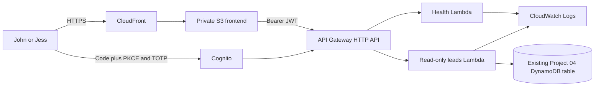

# F4F Operations Dashboard

Project 06 is the authenticated internal application for managing Fenton4Fitness
operations. It is separate from the public marketing website and exposes only a
small, read-only projection of production lead data.

## Phase 2 status

Phase 2 is prepared for an authenticated Coach/OwnerAdmin production deployment
at `app.fenton4fitness.com`. It adds Cognito managed login with authorization
code and PKCE, mandatory TOTP MFA, OwnerAdmin authorization, and read-only
access to allowlisted fields in the existing Project 04 lead table. The Athlete
experience remains a fictional localhost-only prototype. No application
resources, real users, or DNS records have been created by this work.

## Architecture



See [docs/ARCHITECTURE.md](docs/ARCHITECTURE.md) for trust boundaries and the
staged custom-domain rollout.

## Technologies

- Semantic HTML, modular vanilla JavaScript, and responsive CSS
- Cognito authorization-code flow with PKCE and mandatory TOTP MFA
- API Gateway HTTP API with a Cognito JWT authorizer
- Python Lambda functions with a second OwnerAdmin authorization check
- Exact-table, read-only DynamoDB access
- Private S3 origin and CloudFront HTTPS delivery
- Terraform with local, certificate, and application approval gates

## Relationship to Projects 03-05

- Project 03 remains the public Fenton4Fitness website and form frontend.
- Project 04 remains the production lead ingestion and notification pipeline.
- Project 05 remains the public website infrastructure.
- Project 06 reads an allowlisted projection of Project 04 leads; it does not
  change that table, its capture Lambda, or any existing production resource.

## Local development

```powershell
cd frontend
python -m http.server 8080
```

Open `http://localhost:8080`. The local preview gate uses `sessionStorage`, works
only on localhost, and is not a production security boundary.

Run all checks from the repository root:

```powershell
powershell -File scripts/check.ps1
```

## Security approach

- The browser receives no AWS credentials and no Cognito client secret.
- Production routes require a valid Cognito JWT and OwnerAdmin membership.
- The leads Lambda can only scan the exact existing table ARN.
- DynamoDB projection and response allowlists exclude messages, goals, injury
  history, medical notes, and sensitive narrative fields.
- CORS uses explicit origins; API throttling and finite log retention are set.
- Terraform state, tfvars, plans, environment files, and build output are ignored.

See [docs/SECURITY.md](docs/SECURITY.md) before deployment.

## Staged deployment plan

1. Copy `terraform/terraform.tfvars.example` to an ignored tfvars file and set
   the exact existing table identifiers.
2. Plan and separately approve `deployment_stage = "certificate"` to request
   only the ACM certificate in `us-east-1`.
3. Add the reported ACM validation CNAME in Porkbun and wait for `ISSUED`.
4. Review a fresh `deployment_stage = "application"` plan.
5. Apply only after separate approval. Do not create real Cognito users yet.
6. Separately approve and add the Porkbun `app` CNAME to the new
   CloudFront hostname, then verify HTTPS, authentication, and read-only data.

The ignored production tfvars and Terraform state must never be committed.
Terraform generates `js/config.js` with public API/Cognito identifiers at
deployment time; no client secret is generated.

## Planned expansion

Future phases cover audited workflow updates, athlete/client profiles,
scheduling, programs, revenue, messaging, analytics, and governed AI-assisted
workflows. See [docs/ROADMAP.md](docs/ROADMAP.md).
