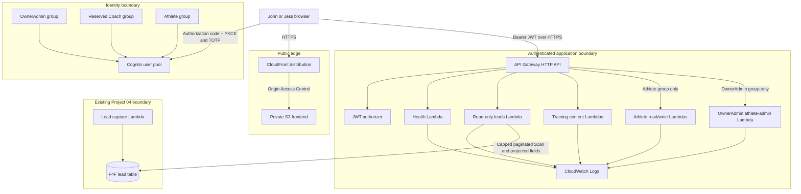

# Architecture

## Current production platform

The frontend never calls DynamoDB. API Gateway validates the Cognito token, and
each Lambda independently enforces the exact group required for its route.
OwnerAdmin routes cover leads, programming, and Athlete administration. Athlete
routes derive ownership from the JWT subject mapping. The reserved `Coach` group
has no production data access in the current slice. Every data route is authenticated.

## Lead-read strategy

Project 04 uses `leadId` as its partition key and has no secondary index. Phase
2 therefore uses a capped, paginated `Scan` with a `ProjectionExpression` and a
second response allowlist. This is acceptable for the current small dataset.
Before volume grows, a purpose-built index or read model should be introduced
through a separately reviewed Project 04 migration.

## Staged production delivery

The custom application domain was delivered through separate approval stages:

1. Certificate stage requests one ACM certificate in `us-east-1`; its validation
   CNAME is added manually in Porkbun and issuance is confirmed.
2. Application stage creates the private frontend, CloudFront alias, Cognito,
   authenticated API, Lambdas, logging, and exact-table read permission.
3. DNS cutover manually adds the approved application CNAME pointing to the
   CloudFront hostname.

Terraform does not manage Porkbun DNS and creates no Cognito users.
