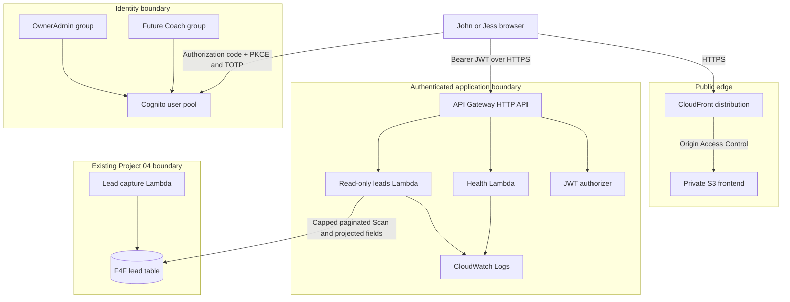

# Architecture

## Phase 2 production target

The frontend never calls DynamoDB. API Gateway validates the Cognito token, and
each Lambda independently requires membership in `OwnerAdmin`. Both routes,
including health, are authenticated. The future `Coach` group has no Phase 2
data access.

## Lead-read strategy

Project 04 uses `leadId` as its partition key and has no secondary index. Phase
2 therefore uses a capped, paginated `Scan` with a `ProjectionExpression` and a
second response allowlist. This is acceptable for the current small dataset.
Before volume grows, a purpose-built index or read model should be introduced
through a separately reviewed Project 04 migration.

## Staged custom-domain rollout

`app.fenton4fitness.com` is the permanent Coach/Athlete platform hostname and
requires separate approvals:

1. Certificate stage requests one ACM certificate in `us-east-1`; its validation
   CNAME is added manually in Porkbun and issuance is confirmed.
2. Application stage creates the private frontend, CloudFront alias, Cognito,
   authenticated API, Lambdas, logging, and exact-table read permission.
3. DNS cutover manually adds an approved Porkbun `app` CNAME pointing to
   the new CloudFront hostname.

Terraform does not manage Porkbun DNS and creates no Cognito users.
