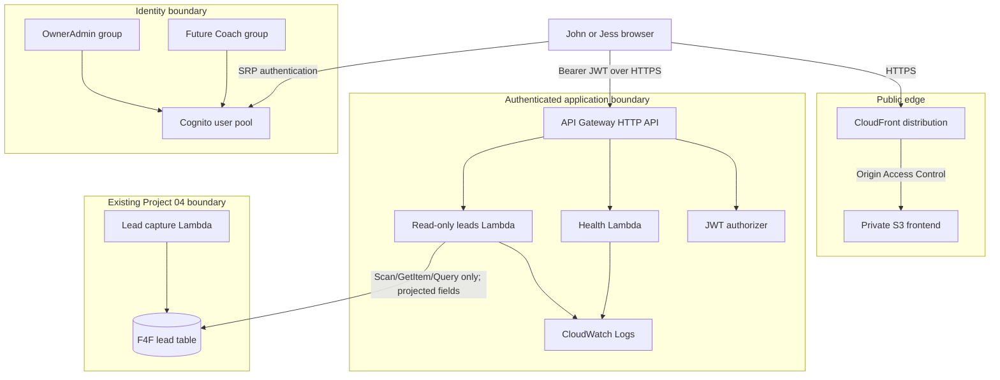

# Architecture

## Phase 1 target

The frontend never calls DynamoDB. Cognito identity is evaluated at API Gateway,
and Lambda receives only already-authorized requests. Phase 1 keeps both routes
authenticated, including health, to avoid creating an unnecessary public API.

## Lead-read strategy

Project 04 uses `leadId` for idempotent writes and stores `submittedAt` as an ISO
timestamp. It does not currently expose a query-oriented index for chronological
lead lists. Phase 1 therefore proposes a capped, paginated `Scan` with a
`ProjectionExpression` and response allowlist. This is acceptable only for the
small initial dataset. Before volume increases, prefer a purpose-built index or
read model created through a separately reviewed Project 04 migration.

## Custom domain later

The initial deployment can use the generated CloudFront hostname. A future
`dashboard.fenton4fitness.com` change requires:

1. An ACM certificate in `us-east-1` covering the dashboard hostname.
2. The hostname added as a CloudFront alternate domain name.
3. A Porkbun CNAME from `dashboard` to the CloudFront domain.
4. Updated CORS and Cognito callback/logout URLs.

No DNS or ACM resource is included in the Phase 1 foundation.
